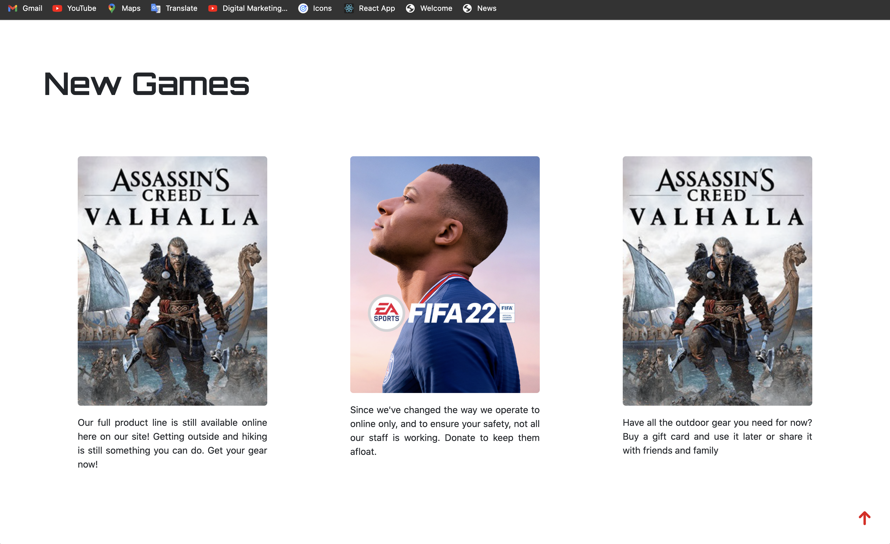
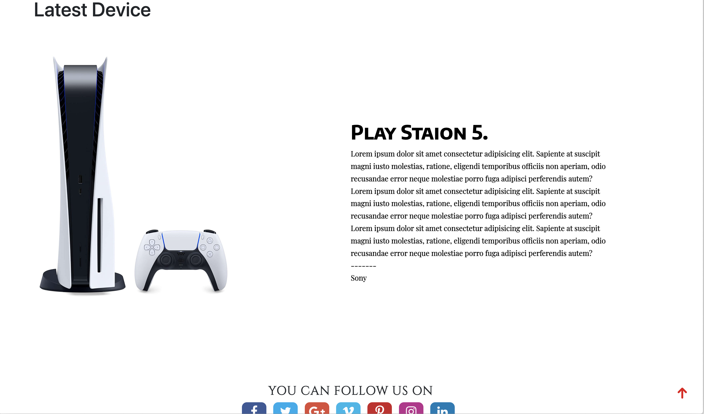
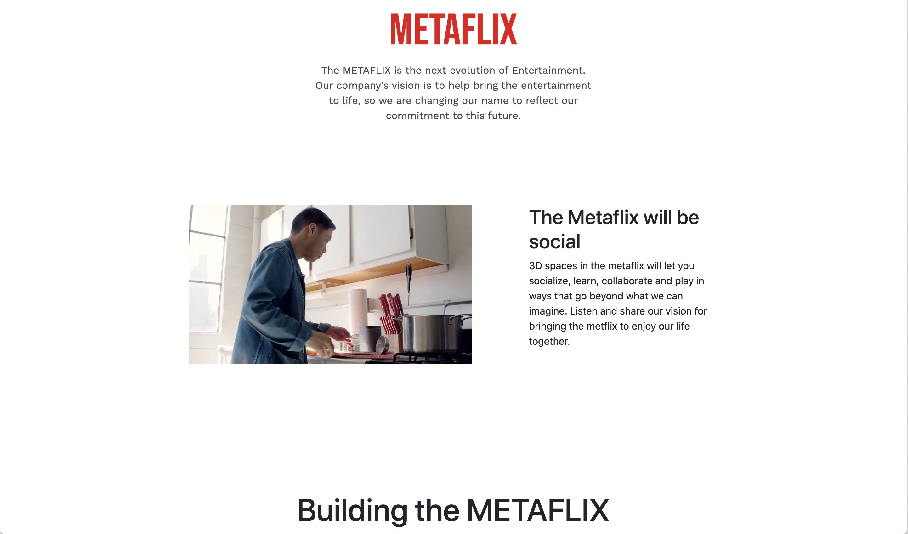
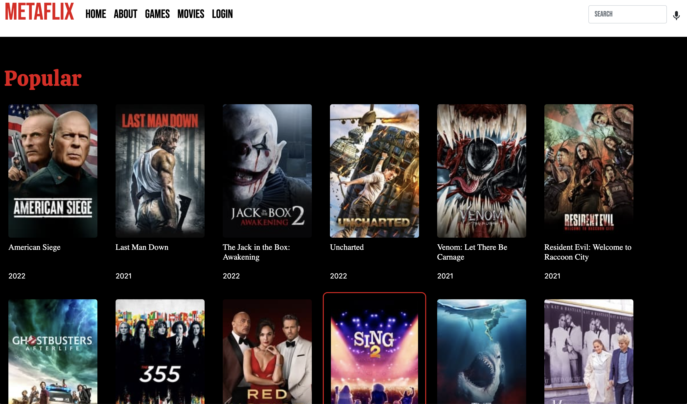
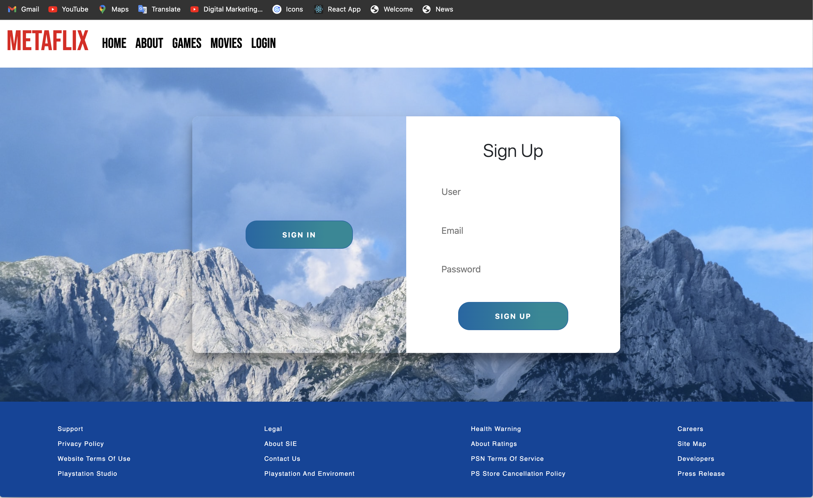

# rtvoter

## Table of Contents. 
* [Over view](#Overview)
* [Supportive Link](#SupportiveLink)
* [What's Next](#What'sNext)
* [Languages](#Languages)
* [contribute](#Contributing)
* [Image](#Image)
* [Contact me](#contact)

## Overview.
The METAFLIX is the next evolution of Entertainment website.Our company’s vision is to help bring the entertainment to life, so we are changing our name to reflect our commitment to this future. This app let the users to get the lateast Movive / Games and the lateast gaming devices. And everything realted to the Virual reality and the next generation of gaming and entertainment.
 ## Supportive Link 
[Watch it Live](https://rtvoter.vercel.app/index.html)

## What's Next.
The next phase of this project is connect with the datebase and let the user create his own profile to can add his favorite movies or games to his profile. 

## Languages.
* The moviedb API
* BootStrap
* JavaSript
* Swiper
* Jquery
* HTML
* CSS

## contribute.
Open to contribute. to help in the backend part.

## Images.

_

_

_

_

_

## Contact Me.
[Shoot me an email](mailto:ibramdarwish@gmail.com)

